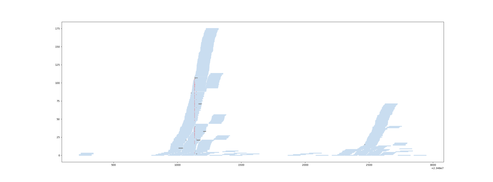

# vizuread

A visualisation tool for sequence alignments, creating IGV-like plots that can be programatically generated

Also provides a Read class and functions to retrieve reads from a bam file, 
even if that's probbaly less useful knowing biopython exists.

For advanced usage, this module requires knowledge about samtools and the sam format.



## Dependencies
- matplotlib
- samtools

## Usage

```py
import matplotlib.pyplot as plt
from vizuread import plot_region, get_reads_from, parse_position

# create a plot with 2 subplots
fig, ax = plt.subplots(nrows=1, ncols=2, figsize=(12,5))
# define regions
region1 = ("chr1", 10000, 20000)        # define a tuple
region2 = "chr2:4587639-5789456"        # or use a string à la IGV

bam_file = "/path/to/your_file.bam"

# plot the first region on the given ax
plot_region(bam_file, region1, ax[0], samtools_options="-F 2") # use the flag -F 2 to exclude all reads that are properly paired.

# extract reads from the second region and specify a path to your samtools bin
reads2 = get_reads_from(bam_file, *parse_position(region2), samtools_command="/bin/samtools")
# subselect reads based on a condition, here reads with deletions
reads2 = [r for r in reads2 if "D" in r.cigar] 
# and plot them
plot_region(reads=reads2, ax=ax[1]) 
# do some additional manipulations to your axes
ax[0].set_title("Reads from first region")
ax[1].set_title("Reads from second region")
plt.suptitle("Main title for the figure")
plt.show()